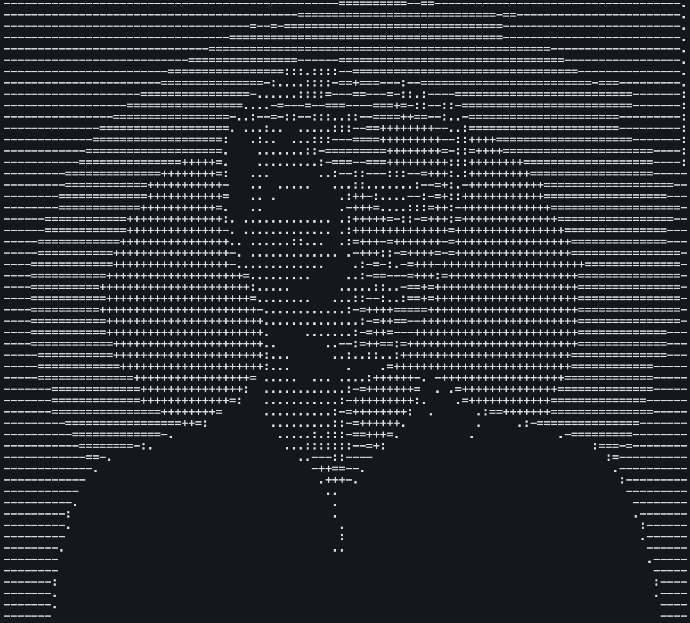

<table>
<tr>
<td width="65%" valign="top">

-------------- ismael salgado --------------------

Argentina 🇦🇷

Senior Full-Stack Developer & Solutions Architect

TypeScript, Node.js, React.js

React.js, Next.js & more

SQLServer, MySQL, PostgreSQL, MongoDB

AWS IAAC (Lambda, S3, RDS, SQS, SNS, Redis, EventBridge) & GCP

Microservices, Event-Driven Architecture

REST, GraphQL

CI/CD (GitHub Actions)

JWT, OAuth

Redis, Docker, Graphana

------------------- Work -----------------------------

Hacemos Software:
  Founder & Backend Lead Developer / Full-Stack Solutions Architect

CHE3D:
  CTO & IT Manager

Buenos Aires City Government:
  Functional Analyst & Java Developer

------------------- Education ------------------------

Data Scientist

Technician in Programming

------------------- Contact --------------------------

Email:      ismael@hacemos.software

LinkedIn:   https://www.linkedin.com/in/ismael-salgado-f/

</td>

<td width="35%" align="center" valign="center">

<a href="https://github.com/isalgadof">
<picture>
<source media="(prefers-color-scheme: dark)" srcset="./pic.png">

</picture>
</a>

</td>
</tr>
</table>
